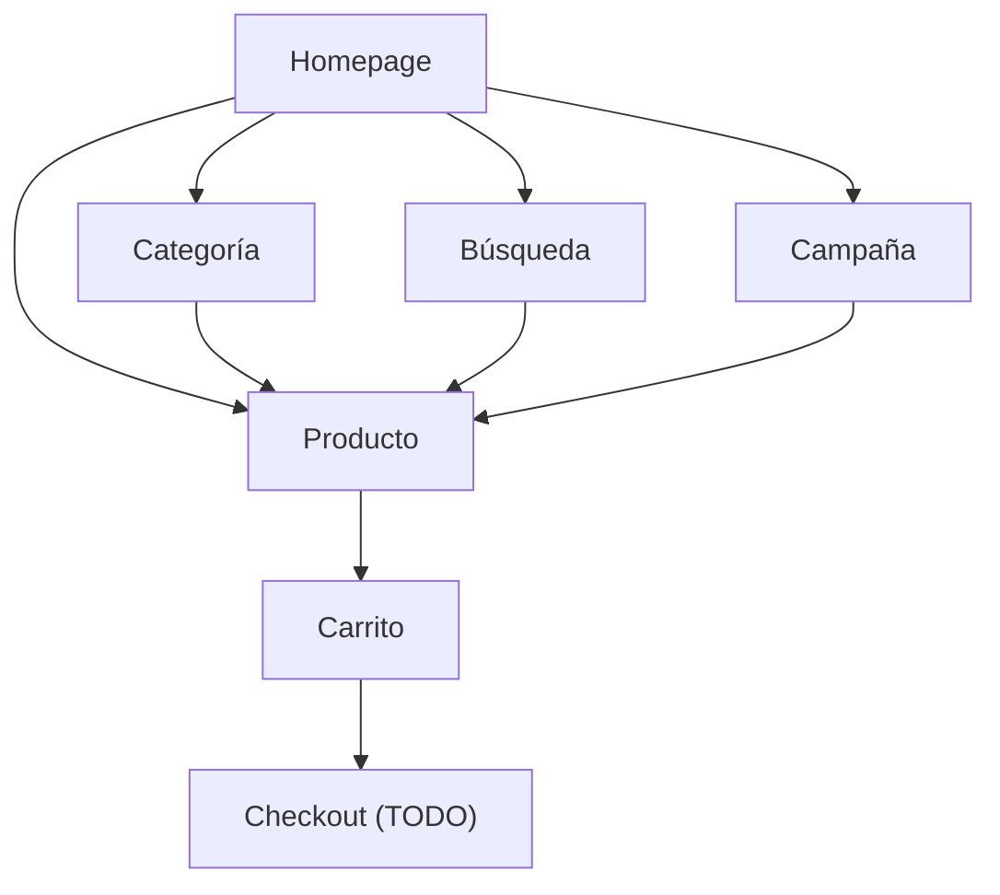

# ByteDigital Front

Storefront público de ByteDigital. Tienda e-commerce de tecnología construida con Nuxt 3, orientada al mercado chileno.

## Stack

- **Nuxt** 3.21 + **Vue** 3.5 (SSR)
- **Tailwind CSS** 3.4 + **shadcn-nuxt** (Radix Vue)
- **Lucide** icons
- **VueUse** para utilidades reactivas
- **Docker** (Node 22-slim)

## Páginas

| Ruta | Archivo | Descripción |
|------|---------|-------------|
| `/` | `pages/index.vue` | Homepage: hero banners, categorías, ofertas, destacados, nuevos, vistos recientemente |
| `/buscar` | `pages/buscar.vue` | Búsqueda con filtros (marca, condición, precio, orden) y paginación |
| `/carrito` | `pages/carrito.vue` | Carrito de compras: gestión de items, subtotal |
| `/categoria/[slug]` | `pages/categoria/[slug].vue` | Productos por categoría con filtros laterales y paginación |
| `/campana/[slug]` | `pages/campana/[slug].vue` | Página de campaña con sus productos asociados |
| `/producto/[slug]` | `pages/producto/[slug].vue` | Detalle de producto: galería, precio, specs, agregar al carrito |

## Componentes

### Layout

| Componente | Descripción |
|------------|-------------|
| `TheHeader` | Header sticky con logo, barra de búsqueda y link al carrito |
| `TheFooter` | Footer con info de la empresa y links |
| `CategoryNav` | Barra de navegación por categorías |
| `SearchBar` | Input con autocompletado (debounce 300ms, max 8 resultados) |

### Producto

| Componente | Props | Descripción |
|------------|-------|-------------|
| `ProductCard` | `product` | Tarjeta de producto para grillas |
| `ProductGrid` | `products[]` | Grilla responsiva 2-6 columnas |
| `ProductGallery` | `images[]` | Galería de imágenes con thumbnails |
| `ProductFilters` | `brands`, `selectedBrand`, `selectedCondition`, `minPrice`, `maxPrice` | Panel de filtros lateral |
| `ProductSort` | `modelValue` | Dropdown de ordenamiento |
| `ProductSpecs` | `specs` | Tabla de especificaciones técnicas |
| `PriceDisplay` | `product` | Precio con descuento y tachado |

### Home

| Componente | Props | Descripción |
|------------|-------|-------------|
| `HeroBanner` | `banners[]` | Carousel auto-rotante (5s) con links |
| `CategoryGrid` | `categories[]` | Grilla de categorías destacadas |
| `FeaturedProducts` | `products[]` | Sección de productos destacados |
| `OfferSection` | `offers[]` | Ofertas imperdibles |
| `NewProducts` | `products[]` | Productos recién agregados |
| `RecommendedProducts` | — | Productos vistos recientemente (localStorage) |

### UI (shadcn-nuxt)

`Button`, `Badge`, `Card`, `Input` — componentes base en `components/ui/`.

## Composables

| Composable | Retorna | Descripción |
|------------|---------|-------------|
| `useApi` | `{ api }` | Cliente HTTP con `$fetch` configurado al `NUXT_PUBLIC_API_BASE` |
| `useCart` | `{ items, addToCart, removeFromCart, updateQuantity, clearCart, cartTotal, cartCount }` | Carrito persistido en localStorage |
| `useSearch` | `{ query, results, loading }` | Búsqueda en tiempo real con debounce 300ms |
| `useRecentlyViewed` | `{ products, addProduct }` | Últimos 10 productos vistos (localStorage) |

## Flujo de usuario



## API Endpoints consumidos

```
GET /banners/?banner_type=hero        → Hero banners
GET /categories/                       → Navegación por categorías
GET /categories/{slug}                 → Categoría específica
GET /products/?search=&filters...      → Búsqueda y filtrado
GET /products/featured                 → Productos destacados
GET /products/new                      → Productos nuevos
GET /products/{slug}                   → Detalle de producto
GET /brands/                           → Listado de marcas (filtros)
GET /offers/                           → Ofertas activas
GET /campaigns/{slug}                  → Detalle de campaña
```

## Design System

- **Colores:** Primary blue (#3b82f6), grays para secondary/background
- **Tipografía:** System fonts via Tailwind
- **Bordes:** `rounded-lg` (8px) por defecto
- **Espaciado:** Escala 4px de Tailwind
- **Breakpoints:** `md` (768px), `lg` (1024px), `xl` (1280px)
- **Max width:** `max-w-7xl` (1280px)
- **Dark mode:** Configurado (`class` strategy) pero no activo

## Setup

```bash
npm install
npm run dev
```

### Variables de entorno

| Variable | Default | Descripción |
|----------|---------|-------------|
| `NUXT_PUBLIC_API_BASE` | `http://localhost:8000` | URL base de la API |

## Build y deploy

```bash
# Build SSR
npm run build

# Docker
docker build -t bytedigital-front .
docker run -p 3000:3000 -e NUXT_PUBLIC_API_BASE=https://api.bytedigital.cl bytedigital-front
```

## Estado actual

- Navegación de catálogo completa (categorías, búsqueda, filtros)
- Carrito de compras funcional (localStorage)
- Páginas de campaña y ofertas
- SEO básico (`useHead` con títulos dinámicos)
- **Pendiente:** checkout, pasarela de pago, autenticación de clientes, cuenta de usuario
