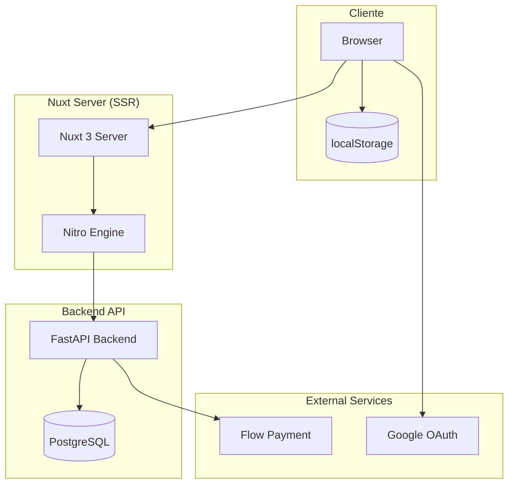
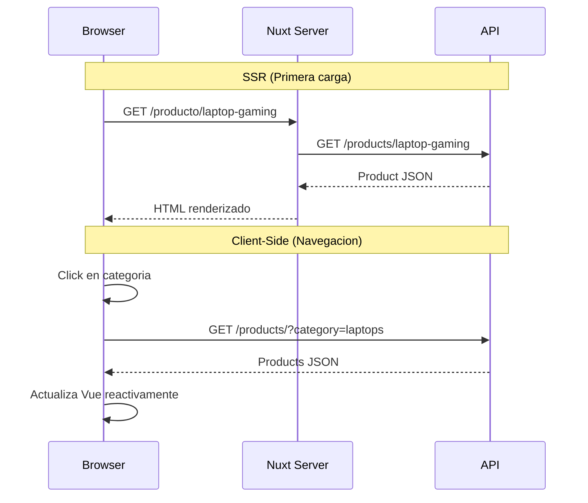
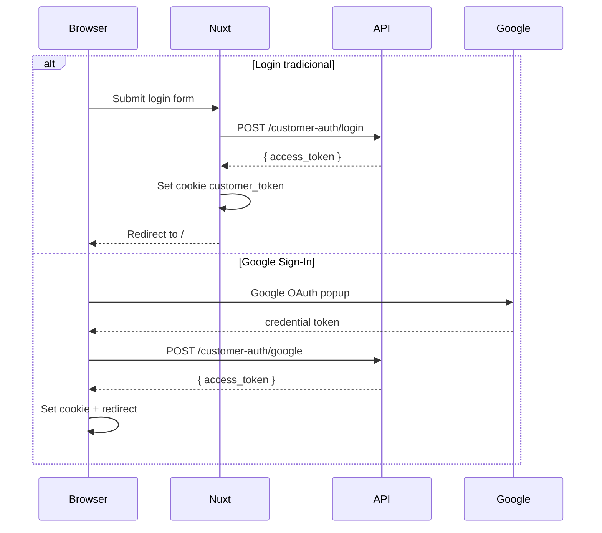
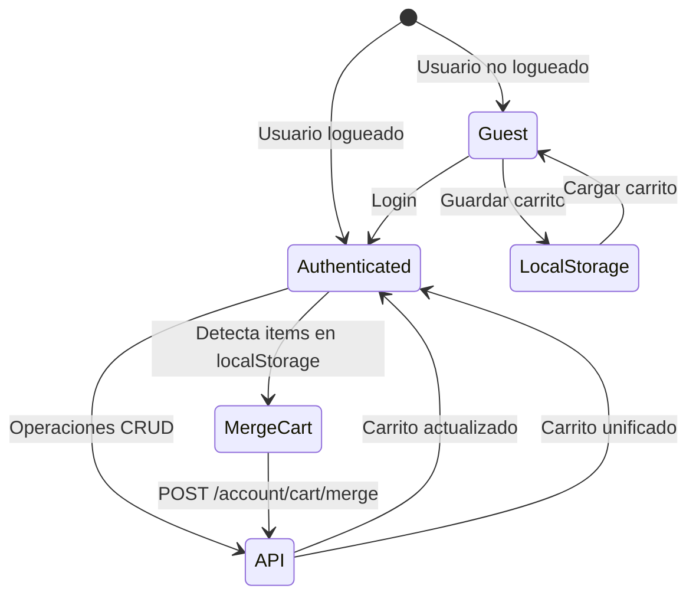
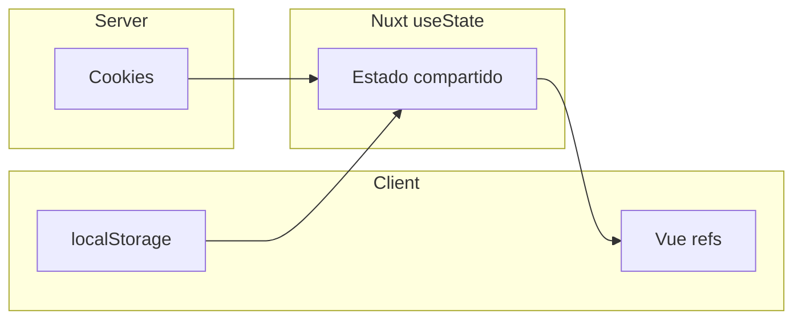

# Arquitectura - ByteDigital Front

## Vision General

ByteDigital Front es una aplicacion **Nuxt 3 SSR** que sirve como storefront publico para la tienda de tecnologia. Utiliza Server-Side Rendering para SEO y performance, con hidratacion cliente para interactividad.

---

## Diagrama de Arquitectura



---

## Estructura de Directorios

```
bytedigital-front/
│
├── app.vue                 # Root component
├── nuxt.config.ts          # Configuracion de Nuxt
├── tailwind.config.ts      # Configuracion de Tailwind
│
├── assets/
│   └── css/               # Estilos globales
│
├── components/
│   ├── home/              # Componentes de homepage
│   │   ├── HeroBanner.vue
│   │   ├── CategoryGrid.vue
│   │   ├── FeaturedProducts.vue
│   │   ├── NewProducts.vue
│   │   ├── OfferSection.vue
│   │   └── RecommendedProducts.vue
│   │
│   ├── layout/            # Componentes de layout
│   │   ├── TheHeader.vue
│   │   ├── TheFooter.vue
│   │   ├── CategoryNav.vue
│   │   ├── SearchBar.vue
│   │   ├── ToastContainer.vue
│   │   └── WhatsAppButton.vue
│   │
│   ├── product/           # Componentes de producto
│   │   ├── ProductCard.vue
│   │   ├── ProductGrid.vue
│   │   ├── ProductGallery.vue
│   │   ├── ProductFilters.vue
│   │   ├── ProductSort.vue
│   │   ├── ProductSpecs.vue
│   │   └── PriceDisplay.vue
│   │
│   └── ui/                # shadcn-nuxt components
│       ├── button/
│       ├── badge/
│       ├── card/
│       └── input/
│
├── composables/           # Logica reutilizable
│   ├── useApi.ts
│   ├── useAuth.ts
│   ├── useCart.ts
│   ├── useSearch.ts
│   ├── useWishlist.ts
│   ├── useToast.ts
│   ├── useRecentlyViewed.ts
│   ├── useSiteConfig.ts
│   └── useScrollReveal.ts
│
├── layouts/
│   └── default.vue        # Layout principal
│
├── lib/
│   └── utils.ts           # cn() helper para clases
│
├── middleware/
│   ├── auth.ts            # Proteccion de rutas
│   └── maintenance.global.ts
│
├── pages/                 # Rutas de la aplicacion
│   ├── index.vue
│   ├── login.vue
│   ├── verificar-email.vue
│   ├── buscar.vue
│   ├── carrito.vue
│   ├── checkout.vue
│   ├── mantenimiento.vue
│   ├── categoria/
│   │   └── [slug].vue
│   ├── producto/
│   │   └── [slug].vue
│   ├── campana/
│   │   └── [slug].vue
│   ├── mi-cuenta.vue      # Parent layout
│   ├── mi-cuenta/
│   │   ├── index.vue
│   │   ├── compras.vue
│   │   ├── compras/
│   │   │   └── [orderNumber].vue
│   │   ├── favoritos.vue
│   │   ├── datos.vue
│   │   ├── direcciones.vue
│   │   ├── facturacion.vue
│   │   └── seguridad.vue
│   └── pago/
│       ├── resultado.vue
│       └── error.vue
│
├── types/
│   └── index.ts           # TypeScript interfaces
│
├── utils/
│   └── format.ts          # Formatters (CLP, discount)
│
└── tests/
    ├── setup.ts
    ├── mocks/
    └── composables/
```

---

## Flujo de Datos

### SSR vs Client-Side



### Flujo de Autenticacion



### Flujo del Carrito



---

## Patrones de Diseno

### Composables Pattern

Toda la logica de negocio esta encapsulada en composables:

```typescript
// composables/useCart.ts
export function useCart() {
  const items = useState<CartItem[]>("cart_items", () => []);
  const cartTotal = useState<number>("cart_total", () => 0);

  async function addToCart(product: Product) { ... }
  async function removeFromCart(productId: number) { ... }

  return { items, cartTotal, addToCart, removeFromCart };
}
```

### useState para Estado Global

Nuxt `useState` permite compartir estado entre componentes y sobrevive la hidratacion SSR:

```typescript
// Estado global accesible desde cualquier componente
const user = useState<CustomerUser | null>("customer_user", () => null);
```

### API Client Pattern

Un composable centralizado maneja todas las llamadas API:

```typescript
// composables/useApi.ts
export function useApi() {
  const config = useRuntimeConfig();
  const token = useCookie("customer_token");

  const api = $fetch.create({
    baseURL: config.public.apiBase,
    onRequest({ options }) {
      if (token.value) {
        options.headers.set("Authorization", `Bearer ${token.value}`);
      }
    },
  });

  return { api };
}
```

---

## Manejo de Estado

### Estado por Ubicacion

| Tipo | Almacenamiento | Ejemplo |
|------|----------------|---------|
| **Usuario** | Cookie + useState | `customer_token`, `customer_user` |
| **Carrito (guest)** | localStorage | `bytedigital_cart` |
| **Carrito (auth)** | API + useState | `cart_items` |
| **Productos vistos** | localStorage | `bytedigital_recently_viewed` |
| **UI temporal** | ref() local | Loading states, modals |

### Persistencia



---

## Sistema de Rutas

### Rutas Publicas

| Ruta | Archivo | Descripcion |
|------|---------|-------------|
| `/` | `pages/index.vue` | Homepage |
| `/buscar` | `pages/buscar.vue` | Busqueda |
| `/categoria/[slug]` | `pages/categoria/[slug].vue` | Productos por categoria |
| `/producto/[slug]` | `pages/producto/[slug].vue` | Detalle de producto |
| `/campana/[slug]` | `pages/campana/[slug].vue` | Campana promocional |
| `/login` | `pages/login.vue` | Auth |
| `/carrito` | `pages/carrito.vue` | Carrito |

### Rutas Protegidas

Requieren middleware `auth`:

| Ruta | Archivo | Descripcion |
|------|---------|-------------|
| `/checkout` | `pages/checkout.vue` | Proceso de pago |
| `/mi-cuenta/*` | `pages/mi-cuenta/` | Area de usuario |

### Middleware

```typescript
// middleware/auth.ts
export default defineNuxtRouteMiddleware((to) => {
  const token = useCookie("customer_token");
  if (!token.value) {
    return navigateTo(`/login?redirect=${encodeURIComponent(to.fullPath)}`);
  }
});
```

---

## Design System

### Colores

```typescript
// tailwind.config.ts
primary: {
  50: "#eff6ff",   // Fondos claros
  500: "#3b82f6",  // Color principal
  600: "#2563eb",  // Botones
  700: "#1d4ed8",  // Hover
}
```

### Breakpoints

| Breakpoint | Min-width | Uso |
|------------|-----------|-----|
| `sm` | 640px | Movil landscape |
| `md` | 768px | Tablets |
| `lg` | 1024px | Desktop |
| `xl` | 1280px | Desktop grande |

### Espaciado

- **Padding contenedor**: `px-4`
- **Max width**: `max-w-7xl` (1280px)
- **Gap grids**: `gap-4` a `gap-8`
- **Border radius**: `rounded-lg` (8px)

---

## Performance

### Optimizaciones SSR

1. **useAsyncData**: Fetch de datos en servidor
2. **useLazyAsyncData**: Fetch no bloqueante
3. **Payload extraction**: Datos serializados en HTML

### Client-Side

1. **Code splitting**: Por ruta automatico
2. **Lazy components**: `<LazyComponent />`
3. **Debounce search**: 300ms en SearchBar
4. **Intersection Observer**: useScrollReveal

### Caching

- **API responses**: Manejado por backend
- **Static assets**: Versionados por Vite
- **Runtime config**: Una vez por request
