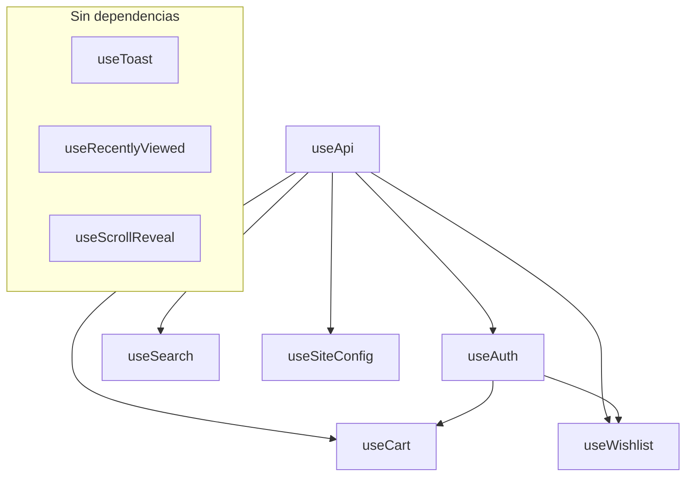

# Composables - ByteDigital Front

Documentacion de los composables disponibles en el proyecto.

---

## useApi

Cliente HTTP centralizado para comunicacion con la API.

### Ubicacion
`composables/useApi.ts`

### Retorna

| Propiedad | Tipo | Descripcion |
|-----------|------|-------------|
| `api` | `$fetch` | Cliente HTTP configurado |

### Uso

```typescript
const { api } = useApi();

// GET request
const products = await api<Product[]>('/products/');

// POST request
const order = await api<Order>('/account/orders/checkout', {
  method: 'POST',
  body: { address_id: 1 }
});
```

### Caracteristicas

- **Base URL dinamica**: Usa `NUXT_API_BASE` en servidor, `NUXT_PUBLIC_API_BASE` en cliente
- **Auth automatica**: Agrega header `Authorization: Bearer {token}` si existe cookie `customer_token`
- **Tipado**: Soporta generics para respuestas tipadas

---

## useAuth

Manejo completo de autenticacion de usuarios.

### Ubicacion
`composables/useAuth.ts`

### Retorna

| Propiedad | Tipo | Descripcion |
|-----------|------|-------------|
| `token` | `Ref<string \| null>` | JWT token (cookie) |
| `user` | `Ref<CustomerUser \| null>` | Datos del usuario |
| `isAuthenticated` | `ComputedRef<boolean>` | Estado de autenticacion |
| `login` | `(email, password) => Promise<void>` | Login tradicional |
| `register` | `(email, password, firstName, lastName, phone?) => Promise<string>` | Registro |
| `resendVerification` | `(email) => Promise<string>` | Reenviar verificacion |
| `loginWithGoogle` | `(credential) => Promise<void>` | Login con Google |
| `fetchUser` | `() => Promise<void>` | Obtener datos del usuario |
| `logout` | `() => void` | Cerrar sesion |

### Uso

```typescript
const { isAuthenticated, user, login, logout } = useAuth();

// Verificar autenticacion
if (isAuthenticated.value) {
  console.log(`Hola, ${user.value?.first_name}`);
}

// Login
try {
  await login('email@example.com', 'password123');
} catch (error) {
  console.error(error.data?.detail);
}

// Logout
logout(); // Limpia token y redirige a /
```

### Notas

- Token almacenado en cookie con `maxAge: 8 horas`
- Auto-fetch de usuario si existe token al cargar
- Google Sign-In requiere `NUXT_PUBLIC_GOOGLE_CLIENT_ID`

---

## useCart

Gestion del carrito de compras con soporte dual (localStorage / API).

### Ubicacion
`composables/useCart.ts`

### Retorna

| Propiedad | Tipo | Descripcion |
|-----------|------|-------------|
| `items` | `Ref<CartItem[]>` | Items del carrito |
| `cartTotal` | `Ref<number>` | Total en CLP |
| `cartCount` | `Ref<number>` | Cantidad de items |
| `hasUnavailableItems` | `Ref<boolean>` | Hay items sin stock |
| `unavailableCount` | `Ref<number>` | Cantidad de items sin stock |
| `suggestions` | `Ref<CartSuggestion[]>` | Productos sugeridos |
| `addToCart` | `(product, qty?) => Promise<boolean>` | Agregar producto |
| `removeFromCart` | `(productId) => Promise<boolean>` | Eliminar producto |
| `updateQuantity` | `(productId, qty) => Promise<boolean>` | Actualizar cantidad |
| `clearCart` | `() => Promise<void>` | Vaciar carrito |
| `mergeCart` | `() => Promise<void>` | Merge localStorage con API |
| `fetchServerCart` | `() => Promise<void>` | Obtener carrito del servidor |

### Uso

```typescript
const { items, cartTotal, addToCart, removeFromCart } = useCart();

// Agregar producto
const success = await addToCart(product, 2);

// Actualizar cantidad
await updateQuantity(productId, 5);

// Eliminar
await removeFromCart(productId);
```

### Flujo de Almacenamiento

```
Usuario no logueado:
  - Carrito en localStorage (key: bytedigital_cart)
  - Operaciones locales

Usuario logueado:
  - Carrito en API (/account/cart/)
  - Al login: merge de localStorage con servidor
  - localStorage se limpia despues del merge
```

### Estado de Stock

El carrito maneja estados de stock para cada item:

| Estado | Descripcion |
|--------|-------------|
| `available` | Stock disponible |
| `limited` | Stock menor a cantidad solicitada |
| `out_of_stock` | Sin stock |
| `inactive` | Producto desactivado |

---

## useSearch

Busqueda en tiempo real con debounce.

### Ubicacion
`composables/useSearch.ts`

### Retorna

| Propiedad | Tipo | Descripcion |
|-----------|------|-------------|
| `query` | `Ref<string>` | Termino de busqueda |
| `results` | `Ref<Product[]>` | Resultados (max 8) |
| `loading` | `Ref<boolean>` | Estado de carga |

### Uso

```typescript
const { query, results, loading } = useSearch();

// Vincular a input
<input v-model="query" />

// Mostrar resultados
<div v-for="product in results" :key="product.id">
  {{ product.name }}
</div>
```

### Caracteristicas

- **Debounce**: 300ms antes de buscar
- **Minimo**: 2 caracteres para iniciar busqueda
- **Max resultados**: 8 productos
- **Auto-clear**: Limpia resultados si query < 2 chars

---

## useWishlist

Lista de productos favoritos (requiere autenticacion).

### Ubicacion
`composables/useWishlist.ts`

### Retorna

| Propiedad | Tipo | Descripcion |
|-----------|------|-------------|
| `items` | `Ref<WishlistItem[]>` | Lista de favoritos |
| `fetchWishlist` | `() => Promise<void>` | Cargar favoritos |
| `addToWishlist` | `(productId) => Promise<void>` | Agregar favorito |
| `removeFromWishlist` | `(productId) => Promise<void>` | Eliminar favorito |
| `isInWishlist` | `(productId) => boolean` | Verificar si esta en favoritos |
| `toggleWishlist` | `(productId) => Promise<void>` | Toggle favorito |

### Uso

```typescript
const { isInWishlist, toggleWishlist } = useWishlist();

// En componente de producto
<button @click="toggleWishlist(product.id)">
  <Heart :class="isInWishlist(product.id) ? 'fill-current' : ''" />
</button>
```

### Notas

- Redirige a `/login` si no esta autenticado
- Auto-fetch al primer uso si autenticado
- Estado compartido entre componentes via `useState`

---

## useToast

Sistema de notificaciones toast.

### Ubicacion
`composables/useToast.ts`

### Retorna

| Propiedad | Tipo | Descripcion |
|-----------|------|-------------|
| `toasts` | `Ref<Toast[]>` | Lista de toasts activos |
| `show` | `(message, type?, duration?) => void` | Mostrar toast |

### Interface Toast

```typescript
interface Toast {
  id: number;
  message: string;
  type: "success" | "error" | "info";
}
```

### Uso

```typescript
const { show } = useToast();

// Success (default)
show('Producto agregado al carrito');

// Error
show('Error al procesar', 'error');

// Con duracion personalizada (ms)
show('Procesando...', 'info', 5000);
```

### Notas

- Duracion default: 2500ms
- Auto-remove al expirar
- Renderizado en `LayoutToastContainer.vue`

---

## useRecentlyViewed

Historial de productos vistos recientemente.

### Ubicacion
`composables/useRecentlyViewed.ts`

### Retorna

| Propiedad | Tipo | Descripcion |
|-----------|------|-------------|
| `products` | `Ref<Product[]>` | Ultimos productos vistos |
| `addProduct` | `(product) => void` | Agregar producto |

### Uso

```typescript
const { products, addProduct } = useRecentlyViewed();

// En pagina de producto
onMounted(() => {
  if (product.value) {
    addProduct(product.value);
  }
});

// En homepage
<HomeRecommendedProducts />
```

### Caracteristicas

- **Max items**: 10 productos
- **Storage**: localStorage (`bytedigital_recently_viewed`)
- **Deduplicacion**: Mueve producto al inicio si ya existe
- **SSR safe**: Solo opera en cliente

---

## useSiteConfig

Configuracion global del sitio desde API.

### Ubicacion
`composables/useSiteConfig.ts`

### Retorna

| Propiedad | Tipo | Descripcion |
|-----------|------|-------------|
| `config` | `Ref<SiteConfig \| null>` | Configuracion |
| `loading` | `Ref<boolean>` | Estado de carga |
| `fetchConfig` | `() => Promise<void>` | Obtener config |

### Interface SiteConfig

```typescript
interface SiteConfig {
  id: number;
  maintenance_mode: boolean;
  maintenance_message: string | null;
  whatsapp_number: string | null;
}
```

### Uso

```typescript
const { config, fetchConfig } = useSiteConfig();

// En layout
await fetchConfig();

// Mostrar WhatsApp button
<LayoutWhatsAppButton v-if="config?.whatsapp_number" />
```

---

## useScrollReveal

Animaciones al hacer scroll (Intersection Observer).

### Ubicacion
`composables/useScrollReveal.ts`

### Retorna

| Propiedad | Tipo | Descripcion |
|-----------|------|-------------|
| `target` | `Ref<HTMLElement \| null>` | Elemento a observar |
| `isVisible` | `Ref<boolean>` | Esta en viewport |

### Uso

```vue
<template>
  <div
    ref="target"
    :class="isVisible ? 'animate-fade-up' : 'opacity-0'"
  >
    Contenido que aparece al scroll
  </div>
</template>

<script setup>
const { target, isVisible } = useScrollReveal({ threshold: 0.2 });
</script>
```

### Opciones

| Opcion | Default | Descripcion |
|--------|---------|-------------|
| `threshold` | 0.1 | Porcentaje visible para activar |

---

## Diagrama de Dependencias


