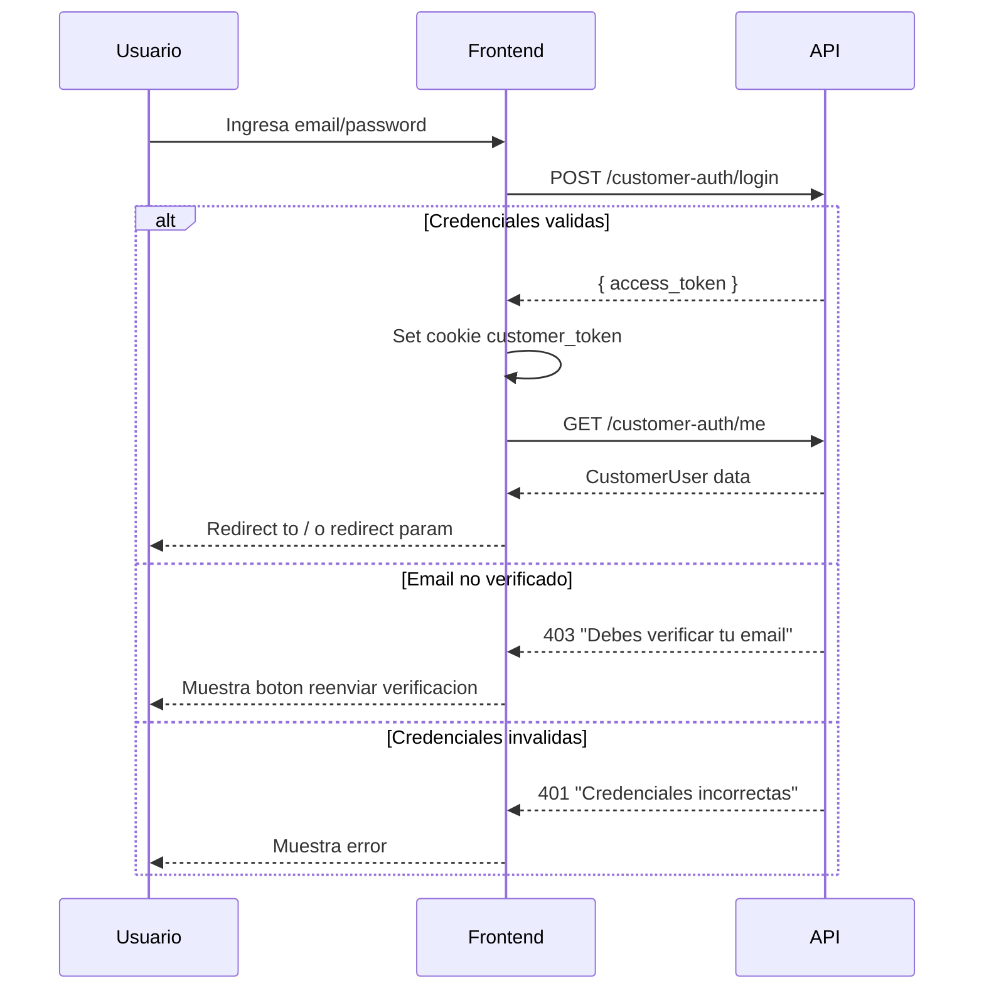
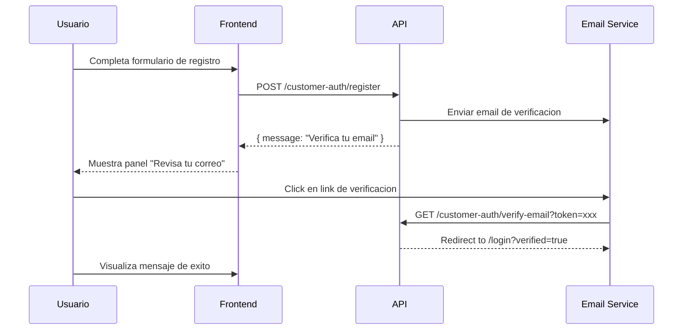
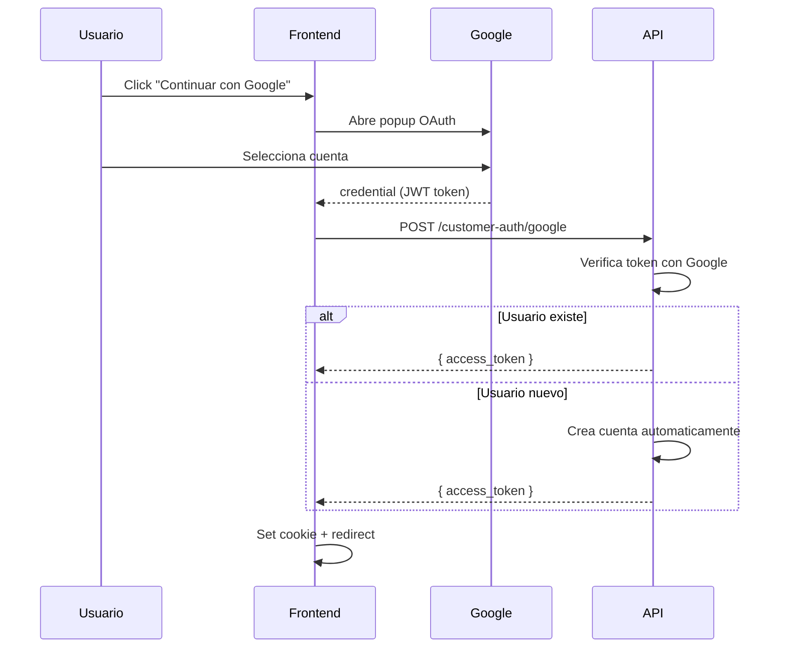

# Modulo de Autenticacion

Sistema de autenticacion para clientes de la tienda.

---

## Componentes del Modulo

| Archivo | Descripcion |
|---------|-------------|
| `pages/login.vue` | Pagina de login y registro |
| `pages/verificar-email.vue` | Verificacion de email |
| `composables/useAuth.ts` | Logica de autenticacion |
| `middleware/auth.ts` | Proteccion de rutas |

---

## Flujo de Autenticacion

### Login Tradicional



### Registro



### Google Sign-In



---

## Pagina de Login

**Archivo**: `pages/login.vue`

### Estructura

```
┌─────────────────────────────────────┐
│         Bienvenido a ByteDigital    │
│         Ingresa o crea cuenta       │
├─────────────────────────────────────┤
│  [Verified success alert]           │  ← Si query.verified=true
│  [Verify error alert]               │  ← Si query.verify_error=true
├─────────────────────────────────────┤
│  [ Iniciar sesion ]  [ Crear cuenta ]│  ← Tabs
├─────────────────────────────────────┤
│                                     │
│  ┌─ LOGIN FORM ──────────────────┐  │
│  │ Email: [                    ] │  │
│  │ Password: [                 ] │  │
│  │ [Error message]               │  │
│  │ [    Iniciar sesion    ]      │  │
│  └───────────────────────────────┘  │
│                                     │
│  ──────── o continuar con ────────  │
│                                     │
│  [      Google Sign-In Button     ] │
│                                     │
└─────────────────────────────────────┘
```

### Estados del Componente

```typescript
const activeTab = ref<"login" | "register">("login");
const loading = ref(false);
const error = ref("");
const needsVerification = ref(false);  // Email no verificado
const showCheckEmail = ref(false);     // Post-registro
const registeredEmail = ref("");
const resendCooldown = ref(0);         // Cooldown 60s para reenvio
```

### Formularios

**Login**:
```typescript
const loginForm = reactive({
  email: "",
  password: ""
});
```

**Registro**:
```typescript
const registerForm = reactive({
  firstName: "",
  lastName: "",
  email: "",
  password: "",
  confirmPassword: ""
});
```

### Validaciones

| Campo | Validacion |
|-------|------------|
| Email | `type="email"` required |
| Password | `required` |
| Password (registro) | `minlength="8"` required |
| Confirm password | Debe coincidir con password |

---

## Verificacion de Email

**Archivo**: `pages/verificar-email.vue`

### Flujo

1. Usuario hace click en link del email
2. Llega a `/verificar-email?token=xxx`
3. Frontend redirige a API: `{API_BASE}/customer-auth/verify-email?token=xxx`
4. API verifica token y redirige a `/login?verified=true` o `/login?verify_error=true`

### Codigo Clave

```typescript
onMounted(() => {
  const token = route.query.token as string;
  if (!token) {
    errorMsg.value = "No se encontro el token";
    return;
  }
  // Redirect to API endpoint
  window.location.href = `${apiBase}/customer-auth/verify-email?token=${token}`;
});
```

---

## Middleware de Auth

**Archivo**: `middleware/auth.ts`

### Implementacion

```typescript
export default defineNuxtRouteMiddleware((to) => {
  const token = useCookie("customer_token");
  if (!token.value) {
    return navigateTo(`/login?redirect=${encodeURIComponent(to.fullPath)}`);
  }
});
```

### Uso

En paginas protegidas:

```typescript
definePageMeta({ middleware: "auth" });
```

### Rutas Protegidas

| Ruta | Descripcion |
|------|-------------|
| `/checkout` | Proceso de pago |
| `/mi-cuenta/*` | Area de usuario |

---

## Composable useAuth

**Archivo**: `composables/useAuth.ts`

### Estado

```typescript
const token = useCookie("customer_token", { maxAge: 60 * 60 * 8 }); // 8 horas
const user = useState<CustomerUser | null>("customer_user", () => null);
const isAuthenticated = computed(() => !!token.value && !!user.value);
```

### Metodos

#### `login(email, password)`

```typescript
async function login(email: string, password: string) {
  const data = await api<{ access_token: string }>("/customer-auth/login", {
    method: "POST",
    body: { email, password },
  });
  token.value = data.access_token;
  await fetchUser();
}
```

#### `register(...)`

```typescript
async function register(
  email: string,
  password: string,
  firstName: string,
  lastName: string,
  phone?: string
) {
  const data = await api<{ message: string }>("/customer-auth/register", {
    method: "POST",
    body: {
      email,
      password,
      first_name: firstName,
      last_name: lastName,
      phone: phone || undefined,
    },
  });
  return data.message;
}
```

#### `loginWithGoogle(credential)`

```typescript
async function loginWithGoogle(credential: string) {
  const data = await api<{ access_token: string }>("/customer-auth/google", {
    method: "POST",
    body: { credential },
  });
  token.value = data.access_token;
  await fetchUser();
}
```

#### `logout()`

```typescript
function logout() {
  token.value = null;
  user.value = null;
  navigateTo("/");
}
```

---

## Google Sign-In

### Configuracion

1. Crear proyecto en Google Cloud Console
2. Configurar OAuth consent screen
3. Crear OAuth 2.0 Client ID (Web application)
4. Agregar origenes autorizados
5. Setear `NUXT_PUBLIC_GOOGLE_CLIENT_ID` en `.env`

### Inicializacion en Frontend

```typescript
onMounted(() => {
  const clientId = config.public.googleClientId;
  if (!clientId) return;

  const initGoogle = () => {
    google.accounts.id.initialize({
      client_id: clientId,
      callback: async (response) => {
        await loginWithGoogle(response.credential);
      },
    });
    google.accounts.id.renderButton(
      document.getElementById("google-signin-button"),
      { theme: "outline", size: "large", text: "continue_with", locale: "es" }
    );
  };

  // Wait for Google script
  if (window.google?.accounts) {
    initGoogle();
  } else {
    const interval = setInterval(() => {
      if (window.google?.accounts) {
        clearInterval(interval);
        initGoogle();
      }
    }, 100);
  }
});
```

### Script en nuxt.config.ts

```typescript
app: {
  head: {
    script: [
      { src: "https://accounts.google.com/gsi/client", async: true, defer: true },
    ],
  },
},
```

---

## Tipos

```typescript
interface CustomerUser {
  id: number;
  email: string;
  first_name: string;
  last_name: string;
  phone: string | null;
  is_active: boolean;
  email_verified: boolean;
  avatar_url: string | null;
  google_linked: boolean;
}
```

---

## API Endpoints

| Endpoint | Metodo | Body | Response |
|----------|--------|------|----------|
| `/customer-auth/login` | POST | `{ email, password }` | `{ access_token }` |
| `/customer-auth/register` | POST | `{ email, password, first_name, last_name, phone? }` | `{ message }` |
| `/customer-auth/google` | POST | `{ credential }` | `{ access_token }` |
| `/customer-auth/verify-email` | GET | `?token=xxx` | Redirect |
| `/customer-auth/resend-verification` | POST | `{ email }` | `{ message }` |
| `/customer-auth/me` | GET | - | `CustomerUser` |
| `/customer-auth/me` | PUT | `{ first_name, last_name, phone }` | `CustomerUser` |
| `/customer-auth/me/password` | PUT | `{ current_password?, new_password }` | `{ message }` |

---

## Manejo de Errores

| Error | Codigo | Manejo |
|-------|--------|--------|
| Email no verificado | 403 | Muestra boton reenviar |
| Credenciales invalidas | 401 | Muestra mensaje error |
| Email ya registrado | 400 | Muestra mensaje error |
| Token expirado | 401 | Redirige a login |
