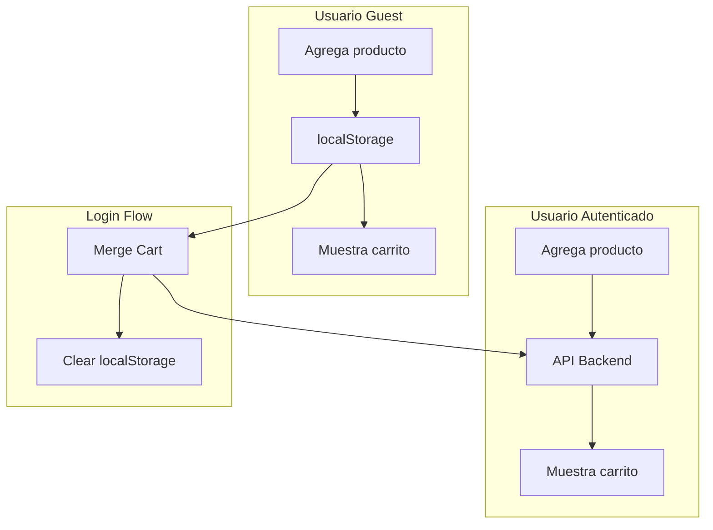
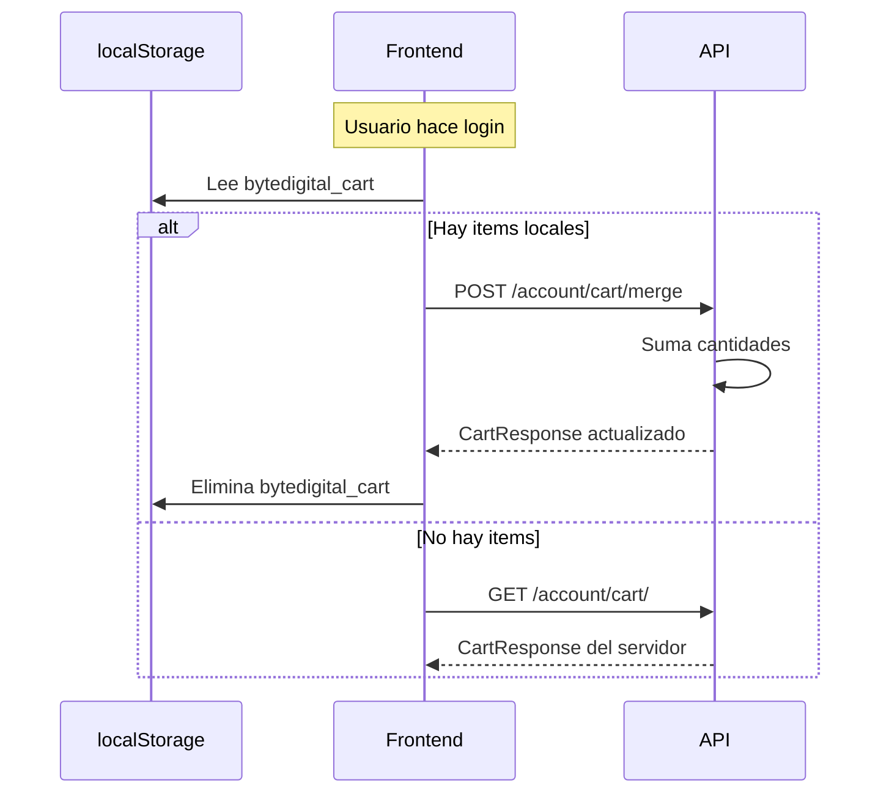

# Modulo de Carrito

Sistema de carrito de compras con soporte dual (localStorage para guests, API para usuarios autenticados).

---

## Componentes del Modulo

| Archivo | Descripcion |
|---------|-------------|
| `pages/carrito.vue` | Pagina del carrito |
| `composables/useCart.ts` | Logica del carrito |
| `components/layout/TheHeader.vue` | Badge del carrito |

---

## Arquitectura



### Estrategia de Almacenamiento

| Estado Usuario | Almacenamiento | Key |
|----------------|----------------|-----|
| Guest | localStorage | `bytedigital_cart` |
| Autenticado | API | `/account/cart/` |

---

## Pagina del Carrito

**Archivo**: `pages/carrito.vue`

### Layout

```
┌─────────────────────────────────────────────────────────┐
│  Carrito de compras                                     │
├─────────────────────────────────────────────────────────┤
│  [Warning: items sin stock]                             │
├─────────────────────────────────────────────────────────┤
│  ┌─────────────────────────────────────────────────┐    │
│  │ [img]  Laptop Gaming XYZ                        │    │
│  │        Marca ABC                                │    │
│  │        $899.990                                 │    │
│  │        [-] 2 [+]           Eliminar   $1.799.980│    │
│  └─────────────────────────────────────────────────┘    │
│                                                         │
│  ┌─────────────────────────────────────────────────┐    │
│  │ [img]  Monitor 27"                              │    │
│  │        [Stock limitado: solo 1 disponible]      │    │
│  └─────────────────────────────────────────────────┘    │
├─────────────────────────────────────────────────────────┤
│  Subtotal                               $2.099.970      │
│  Envio                                  Gratis          │
│  ────────────────────────────────────────────────       │
│  Total                                  $2.099.970      │
│                                                         │
│  [Seguir comprando]  [Proceder al pago]                 │
├─────────────────────────────────────────────────────────┤
│  Te puede interesar (si hay items sin stock)            │
│  [Prod 1] [Prod 2] [Prod 3] [Prod 4]                    │
└─────────────────────────────────────────────────────────┘
```

### Estados de Stock

Items se muestran con estilos segun estado:

| Estado | Estilo | Comportamiento |
|--------|--------|----------------|
| `available` | Normal | Permite +/- cantidad |
| `limited` | Borde amber | Muestra mensaje, limita max cantidad |
| `out_of_stock` | Borde rojo, opaco | Botones deshabilitados |
| `inactive` | Borde rojo, opaco | Producto desactivado |

### Codigo de Estilos

```vue
<div
  class="flex gap-4 border rounded-lg p-4"
  :class="{
    'border-red-300 bg-red-50': item.stock_status === 'out_of_stock' || item.stock_status === 'inactive',
    'border-amber-300 bg-amber-50': item.stock_status === 'limited'
  }"
>
```

---

## Composable useCart

**Archivo**: `composables/useCart.ts`

### Estado

```typescript
const items = useState<CartItem[]>("cart_items", () => []);
const cartTotal = useState<number>("cart_total", () => 0);
const cartCount = useState<number>("cart_count", () => 0);
const initialized = useState<boolean>("cart_init", () => false);

// Estado de stock
const hasUnavailableItems = useState<boolean>("cart_has_unavailable", () => false);
const unavailableCount = useState<number>("cart_unavailable_count", () => 0);
const suggestions = useState<CartSuggestion[]>("cart_suggestions", () => []);
```

### Calculo de Totales

```typescript
function _recalc(items: CartItem[], total: Ref<number>, count: Ref<number>) {
  total.value = items.reduce((sum, item) => {
    // Solo cuenta items disponibles
    if (item.stock_status === "out_of_stock" || item.stock_status === "inactive") {
      return sum;
    }
    const price = item.unit_price || item.product.sale_price || item.product.base_price;
    const qty = item.stock_status === "limited" && item.available_stock
      ? Math.min(item.quantity, item.available_stock)
      : item.quantity;
    return sum + price * qty;
  }, 0);

  count.value = items.reduce((sum, item) => sum + item.quantity, 0);
}
```

---

## Operaciones del Carrito

### Agregar Producto

```typescript
async function addToCart(product: Product, quantity = 1): Promise<boolean> {
  if (isAuthenticated.value) {
    // API call
    const cart = await api<CartResponse>("/account/cart/items", {
      method: "POST",
      body: { product_id: product.id, quantity },
    });
    setCartData(cart);
  } else {
    // localStorage
    const existing = items.value.find((i) => i.product.id === product.id);
    if (existing) {
      existing.quantity += quantity;
    } else {
      items.value.push({ product, quantity });
    }
    saveToStorage();
  }
  return true;
}
```

### Actualizar Cantidad

```typescript
async function updateQuantity(productId: number, quantity: number): Promise<boolean> {
  if (quantity <= 0) {
    return removeFromCart(productId);
  }

  if (isAuthenticated.value) {
    const item = items.value.find((i) => i.product.id === productId);
    if (item?.id) {
      const cart = await api<CartResponse>(`/account/cart/items/${item.id}`, {
        method: "PUT",
        body: { quantity },
      });
      setCartData(cart);
    }
  } else {
    const item = items.value.find((i) => i.product.id === productId);
    if (item) {
      item.quantity = quantity;
      saveToStorage();
    }
  }
  return true;
}
```

### Eliminar Producto

```typescript
async function removeFromCart(productId: number): Promise<boolean> {
  if (isAuthenticated.value) {
    const item = items.value.find((i) => i.product.id === productId);
    if (item?.id) {
      const cart = await api<CartResponse>(`/account/cart/items/${item.id}`, {
        method: "DELETE",
      });
      setCartData(cart);
    }
  } else {
    items.value = items.value.filter((i) => i.product.id !== productId);
    saveToStorage();
  }
  return true;
}
```

---

## Merge de Carrito

Cuando un usuario hace login, se mergean los items de localStorage con el carrito del servidor.

```typescript
async function mergeCart() {
  if (!isAuthenticated.value) return;
  if (import.meta.server) return;

  const raw = localStorage.getItem(CART_KEY);
  if (!raw) {
    await fetchServerCart();
    return;
  }

  let localItems: CartItem[] = JSON.parse(raw);

  if (localItems.length > 0) {
    const mergePayload = localItems.map((i) => ({
      product_id: i.product.id,
      quantity: i.quantity,
    }));

    const cart = await api<CartResponse>("/account/cart/merge", {
      method: "POST",
      body: mergePayload,
    });
    setCartData(cart);
  } else {
    await fetchServerCart();
  }

  localStorage.removeItem(CART_KEY);
}
```

### Flujo de Merge



---

## Tipos

```typescript
interface CartItem {
  id?: number;              // Solo si viene de API
  product: Product;
  quantity: number;
  unit_price?: number;      // Precio al momento de agregar
  available_stock?: number; // Stock disponible
  stock_status?: "available" | "limited" | "out_of_stock" | "inactive";
  stock_message?: string | null;
}

interface CartSuggestion {
  id: number;
  name: string;
  slug: string;
  base_price: number;
  sale_price: number | null;
  image_url: string | null;
}

interface CartResponse {
  id: number;
  items: CartItem[];
  total: number;
  has_unavailable_items: boolean;
  unavailable_count: number;
  suggestions: CartSuggestion[];  // Productos sugeridos cuando hay problemas
}
```

---

## Costo de Envio

```typescript
// En carrito.vue
const shippingCost = computed(() =>
  cartTotal.value >= 50000 ? 0 : 3990
);

const finalTotal = computed(() =>
  cartTotal.value + shippingCost.value
);
```

| Subtotal | Envio |
|----------|-------|
| >= $50.000 | Gratis |
| < $50.000 | $3.990 |

---

## Navegacion a Checkout

```typescript
function proceedToCheckout() {
  if (hasUnavailableItems.value) {
    showToast("Resuelve los problemas de stock", "error");
    return;
  }

  if (isAuthenticated.value) {
    navigateTo("/checkout");
  } else {
    navigateTo("/login?redirect=/checkout");
  }
}
```

---

## API Endpoints

| Endpoint | Metodo | Descripcion |
|----------|--------|-------------|
| `/account/cart/` | GET | Obtener carrito actual |
| `/account/cart/` | DELETE | Vaciar carrito |
| `/account/cart/items` | POST | Agregar item |
| `/account/cart/items/{id}` | PUT | Actualizar cantidad |
| `/account/cart/items/{id}` | DELETE | Eliminar item |
| `/account/cart/merge` | POST | Merge con localStorage |

### Request Body - Agregar Item

```json
{
  "product_id": 123,
  "quantity": 2
}
```

### Request Body - Merge

```json
[
  { "product_id": 123, "quantity": 2 },
  { "product_id": 456, "quantity": 1 }
]
```

---

## Integracion con Header

El componente `TheHeader.vue` muestra el estado del carrito:

```vue
<NuxtLink to="/carrito" class="relative">
  <ShoppingCart class="w-5 h-5" />
  <span class="hidden sm:inline">{{ formatCLP(cartTotal) }}</span>
  <span
    v-if="cartCount > 0"
    class="absolute -top-2 -right-2 bg-red-500 text-white text-[10px] rounded-full w-5 h-5"
  >
    {{ cartCount }}
  </span>
</NuxtLink>
```

---

## Inicializacion

El carrito se inicializa automaticamente al montar el composable:

```typescript
if (import.meta.client && !initialized.value) {
  initialized.value = true;
  if (isAuthenticated.value) {
    mergeCart();  // Merge y fetch de API
  } else {
    loadFromStorage();  // Cargar de localStorage
  }
}
```
