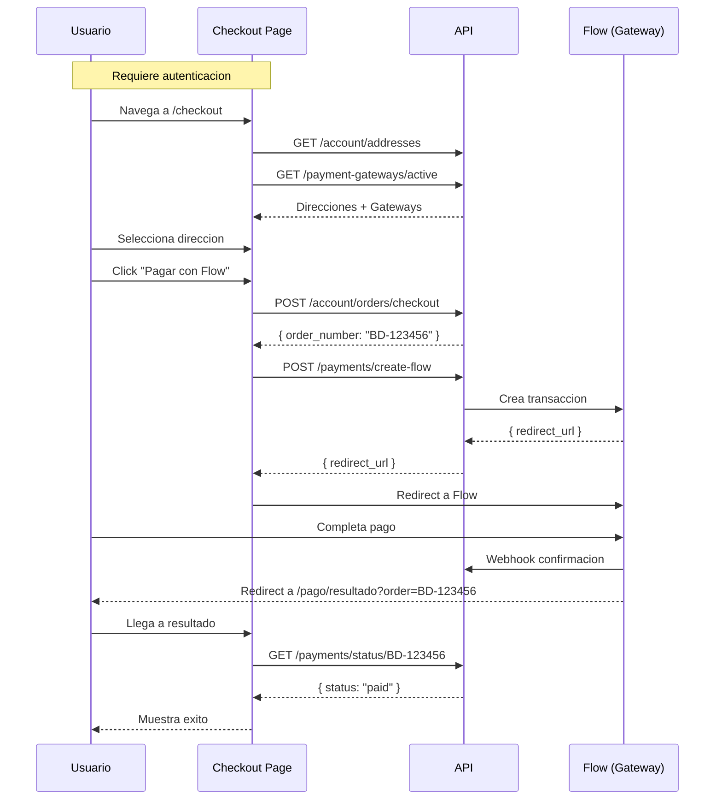

# Modulo de Checkout

Proceso de pago y creacion de ordenes.

---

## Componentes del Modulo

| Archivo | Descripcion |
|---------|-------------|
| `pages/checkout.vue` | Proceso de checkout |
| `pages/pago/resultado.vue` | Resultado del pago |
| `pages/pago/error.vue` | Error en pago |

---

## Flujo de Checkout



---

## Pagina de Checkout

**Archivo**: `pages/checkout.vue`

### Proteccion

```typescript
definePageMeta({ middleware: "auth" });
```

### Layout

```
┌─────────────────────────────────────────────────────────┐
│  Checkout                                               │
├─────────────────────────────────────────────────────────┤
│  1. Direccion de envio                                  │
│  ┌─────────────────────────────────────────────────┐    │
│  │ (o) Casa                                        │    │
│  │     Av. Principal 123, Depto 45                 │    │
│  │     Providencia, Metropolitana                  │    │
│  └─────────────────────────────────────────────────┘    │
│  ┌─────────────────────────────────────────────────┐    │
│  │ ( ) Oficina                                     │    │
│  │     Calle Comercio 456                          │    │
│  │     Las Condes, Metropolitana                   │    │
│  └─────────────────────────────────────────────────┘    │
├─────────────────────────────────────────────────────────┤
│  2. Resumen del pedido                                  │
│  ┌─────────────────────────────────────────────────┐    │
│  │ [img] Laptop Gaming x2          $1.799.980      │    │
│  │ [img] Mouse Wireless x1         $29.990         │    │
│  └─────────────────────────────────────────────────┘    │
│  Subtotal                          $1.829.970          │
│  Envio                             Gratis              │
│  Total                             $1.829.970          │
├─────────────────────────────────────────────────────────┤
│  3. Pagar                                               │
│  [          Flow - Pagar con tarjeta          ]         │
│                                                         │
│  [Error message]                                        │
│  Procesando tu pedido...                                │
└─────────────────────────────────────────────────────────┘
```

### Estado

```typescript
const addresses = ref<CustomerAddress[]>([]);
const selectedAddressId = ref<number | null>(null);
const gateways = ref<PaymentGatewayPublic[]>([]);
const loadingGateways = ref(true);
const processing = ref(false);
const error = ref("");
```

### Carga Inicial

```typescript
onMounted(async () => {
  const [addrs, gws] = await Promise.all([
    api<CustomerAddress[]>("/account/addresses"),
    api<PaymentGatewayPublic[]>("/payment-gateways/active"),
  ]);

  addresses.value = addrs;
  gateways.value = gws;
  loadingGateways.value = false;

  // Auto-select default address
  const defaultAddr = addrs.find((a) => a.is_default);
  if (defaultAddr) {
    selectedAddressId.value = defaultAddr.id;
  } else if (addrs.length > 0) {
    selectedAddressId.value = addrs[0].id;
  }
});
```

---

## Proceso de Pago

### Funcion pay()

```typescript
async function pay(gatewaySlug: string) {
  // Validaciones
  if (!selectedAddressId.value) {
    error.value = "Selecciona una direccion de envio";
    return;
  }
  if (cartItems.value.length === 0) {
    error.value = "Tu carrito esta vacio";
    return;
  }

  processing.value = true;
  error.value = "";

  try {
    // 1. Crear orden
    const order = await api<{ order_number: string }>("/account/orders/checkout", {
      method: "POST",
      body: { address_id: selectedAddressId.value },
    });

    // 2. Segun gateway, procesar pago
    if (gatewaySlug === "flow") {
      const payment = await api<{ redirect_url: string }>("/payments/create-flow", {
        method: "POST",
        body: { order_number: order.order_number },
      });
      // Redirect a Flow
      window.location.href = payment.redirect_url;
    } else {
      // Otros gateways futuros
      navigateTo(`/mi-cuenta/compras/${order.order_number}`);
    }
  } catch (e: any) {
    error.value = e.data?.detail || "Error al procesar el pedido";
    processing.value = false;
  }
}
```

---

## Pagina de Resultado

**Archivo**: `pages/pago/resultado.vue`

### Flujo

1. Flow redirige a `/pago/resultado?order=BD-123456`
2. Frontend hace polling a `/payments/status/{order}`
3. Muestra resultado segun status

### Estados

| Estado | Visual |
|--------|--------|
| `polling` | Spinner + "Procesando tu pago..." |
| `paid` | Check verde + "Pago exitoso" |
| `failed` | X roja + "Pago no completado" |

### Codigo de Polling

```typescript
onMounted(async () => {
  if (!orderNumber.value) {
    status.value = "failed";
    polling.value = false;
    return;
  }

  // Poll hasta 15 intentos (30 segundos)
  const maxAttempts = 15;
  for (let i = 0; i < maxAttempts; i++) {
    try {
      const data = await api<{ status: string }>(`/payments/status/${orderNumber.value}`);

      if (data.status === "paid") {
        status.value = "paid";
        polling.value = false;
        return;
      }

      if (data.status === "cancelled" || data.status === "refunded") {
        status.value = "failed";
        polling.value = false;
        return;
      }
    } catch {
      // Continuar polling
    }

    await new Promise((r) => setTimeout(r, 2000)); // 2s entre intentos
  }

  // Timeout - un intento final
  try {
    const data = await api<{ status: string }>(`/payments/status/${orderNumber.value}`);
    status.value = data.status === "paid" ? "paid" : "failed";
  } catch {
    status.value = "failed";
  }
  polling.value = false;
});
```

### Layout Resultado Exitoso

```
┌─────────────────────────────────────┐
│           [Check verde]             │
│         Pago exitoso                │
│   Tu orden ha sido confirmada       │
│                                     │
│       [Ver mi orden]                │
└─────────────────────────────────────┘
```

### Layout Resultado Fallido

```
┌─────────────────────────────────────┐
│             [X roja]                │
│       Pago no completado            │
│  Tu pago fue rechazado o cancelado  │
│                                     │
│  [Volver al carrito] [Seguir comprando] │
└─────────────────────────────────────┘
```

---

## API Endpoints

### Crear Orden

```
POST /account/orders/checkout
```

**Request**:
```json
{
  "address_id": 1
}
```

**Response**:
```json
{
  "order_number": "BD-123456"
}
```

### Crear Pago Flow

```
POST /payments/create-flow
```

**Request**:
```json
{
  "order_number": "BD-123456"
}
```

**Response**:
```json
{
  "redirect_url": "https://www.flow.cl/app/web/pay.php?token=xxx"
}
```

### Consultar Estado

```
GET /payments/status/{order_number}
```

**Response**:
```json
{
  "status": "paid"
}
```

### Gateways Activos

```
GET /payment-gateways/active
```

**Response**:
```json
[
  {
    "slug": "flow",
    "name": "Flow - Pagar con tarjeta",
    "logo_url": null
  }
]
```

---

## Tipos

```typescript
interface PaymentGatewayPublic {
  slug: string;
  name: string;
  logo_url: string | null;
}

interface CustomerAddress {
  id: number;
  label: string;
  street: string;
  number: string;
  apartment: string | null;
  comuna: string;
  region: string;
  zip_code: string | null;
  country: string;
  phone: string | null;
  recipient_name: string | null;
  is_default: boolean;
}
```

---

## Costo de Envio

El mismo calculo que en carrito:

```typescript
const shippingCost = computed(() =>
  cartTotal.value >= 50000 ? 0 : 3990
);
```

---

## Estados de Orden

| Estado | Descripcion |
|--------|-------------|
| `pending_payment` | Esperando pago |
| `paid` | Pagado exitosamente |
| `processing` | En preparacion |
| `shipped` | Enviado |
| `delivered` | Entregado |
| `cancelled` | Cancelado |
| `refunded` | Reembolsado |

---

## Integracion con Flow

Flow es la pasarela de pago utilizada en Chile. El proceso es:

1. **Backend crea transaccion** en Flow con monto y datos
2. **Flow retorna URL** de pago
3. **Frontend redirige** a esa URL
4. **Usuario paga** en Flow
5. **Flow notifica** via webhook al backend
6. **Flow redirige** al usuario a `/pago/resultado`
7. **Frontend consulta** estado via polling

### Configuracion Backend

Las credenciales de Flow se configuran en el backend:
- `FLOW_API_KEY`
- `FLOW_SECRET_KEY`
- `FLOW_ENVIRONMENT` (sandbox/production)
